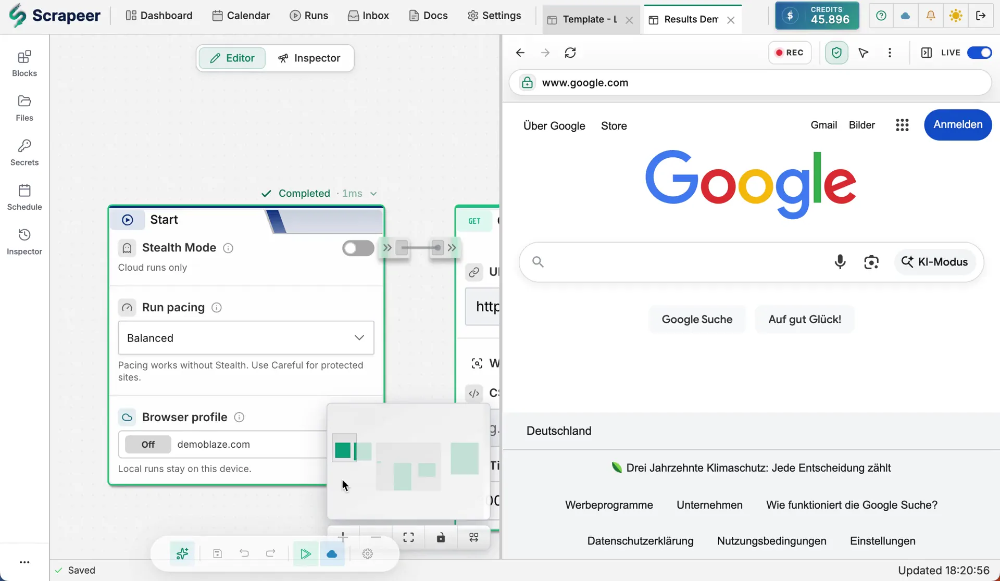

<p align="center">
  <a href="https://www.scrapeer.com">
    
  </a>
</p>

<h1 align="center">Scrapeer n8n Nodes</h1>

<p align="center">
  Run saved Scrapeer browser automation and web scraping flows from n8n workflows.
</p>

<p align="center">
  <a href="https://www.npmjs.com/package/@scrapeer/n8n-nodes-scrapeer"></a>
  <a href="https://docs.scrapeer.com/integrations/n8n/"></a>
  <a href="https://www.scrapeer.com"></a>
  <a href="https://github.com/Scrapeer/scrapeer-n8n/actions/workflows/ci.yml"></a>
</p>

[Scrapeer](https://www.scrapeer.com) is a visual browser automation and web scraping platform for people who do not want to write scrapers from scratch. Build deterministic scraping workflows in a drag-and-drop editor, watch the browser run step by step, then run those same flows in Scrapeer's cloud.

This package adds Scrapeer community nodes to [n8n](https://n8n.io/) for web scraping automation, browser workflow execution, data extraction, and run-result handoff. Use it when n8n needs a real browser workflow instead of a simple HTTP request.

With the Scrapeer n8n integration you can:

- start saved Scrapeer Cloud Runs from any n8n workflow
- pass n8n data into Scrapeer flows as runtime input variables
- wait for short browser jobs and continue with structured output
- poll longer browser jobs and retrieve results later
- trigger n8n workflows when Scrapeer Cloud Runs reach a terminal status

<p align="center">
  
</p>

## Why Scrapeer and n8n

n8n is excellent for moving data between apps. Scrapeer is built for browser workflows that need a real page, selectors, retries, variables, and observable run output. Together, n8n handles the automation pipeline while Scrapeer handles the browser execution.

Typical workflows:

- new Google Sheet row with a URL -> Scrapeer runs a saved flow -> n8n writes the extracted result back
- incoming webhook -> Scrapeer checks a product page -> n8n sends a Slack alert
- scheduled n8n workflow -> Scrapeer runs a monitored browser task -> n8n routes failed runs to a review queue

## Links

- Website: [scrapeer.com](https://www.scrapeer.com)
- n8n integration docs: [docs.scrapeer.com/integrations/n8n](https://docs.scrapeer.com/integrations/n8n/)
- npm package: [@scrapeer/n8n-nodes-scrapeer](https://www.npmjs.com/package/@scrapeer/n8n-nodes-scrapeer)
- Issues: [github.com/Scrapeer/scrapeer-n8n/issues](https://github.com/Scrapeer/scrapeer-n8n/issues)

## Quick Start

Install the community node in n8n:

1. Open **Settings** in n8n.
2. Open **Community nodes**.
3. Choose **Install**.
4. Enter this package name:

```text
@scrapeer/n8n-nodes-scrapeer
```

Then create a **Scrapeer API** credential in n8n and paste a Scrapeer API key from [Scrapeer settings](https://app.scrapeer.com/settings#security).

Required API key scopes:

- `flows:read`
- `runs:read`
- `runs:write`
- `account:read`

The credential test calls `GET /api/v1/user/entitlements`.

## Nodes

### Scrapeer

Use the **Scrapeer** action node to list flows, start Cloud Runs, wait for a run, fetch one run, or list recent runs.

| Action | Description |
|--------|-------------|
| List saved flows | List saved Scrapeer flows available to the API key |
| Start a saved cloud run | Start a Cloud Run and return the execution ID immediately |
| Start a saved cloud run and wait for the result | Start a Cloud Run and poll until it finishes or the timeout is reached |
| Fetch run status and output | Fetch status, output, error, and metadata for one execution |
| List recent cloud runs | List recent Scrapeer cloud executions |

### Scrapeer Trigger

Use **Scrapeer Trigger** to poll for terminal Cloud Runs and start an n8n workflow with the run result.

Supported terminal statuses:

- `completed`
- `failed`
- `cancelled`
- `filtered`

By default, the trigger records already-seen runs on the first poll without emitting them. Enable **Emit Existing Runs on First Poll** only when you want the first trigger execution to include recent finished runs.

## Input Variables

Run actions support **Input Variables**, a JSON object that seeds Scrapeer variables before the flow starts.

```json
{
  "url": "https://example.com/products",
  "searchTerm": "running shoes"
}
```

Use those values inside Scrapeer with `{{url}}`, `{{searchTerm}}`, or another matching variable name.

Input variable names must start with a letter or `_`, then use letters, numbers, or `_`. Names beginning with `__` are reserved. Keep inputs small and structured; do not pass large scraped datasets or files.

## Idempotency

Run actions generate an idempotency key automatically when the field is left empty. This prevents duplicate Scrapeer Cloud Runs if n8n retries the same node execution. Provide your own idempotency key only when you need to coordinate retries across separate n8n executions.

## Entitlements and Security

Cloud run actions require an active Scrapeer subscription. The node checks `features.cloudRun.allowed` before starting a run for clearer errors, and the Scrapeer API enforces the entitlement again on `POST /api/v1/cloud/run`.

The node sends your API key as an `Authorization: Bearer` header to `https://auth.scrapeer.com`.

## Output

Run result items include stable Scrapeer fields such as:

- `execution_id`
- `project_id`
- `project_title`
- `status`
- `mode`
- `trigger`
- `created_at`
- `updated_at`
- `finished_at`
- `duration_ms`
- `credits_used`
- `data`
- `outputs`
- `error`
- `workflow_id`

Large files and artifacts should be handled as links or metadata. The node does not return raw internal block previews by default.

## Development

```bash
pnpm install
pnpm lint
pnpm typecheck
pnpm build
```

This package is published with npm provenance from GitHub Actions.
